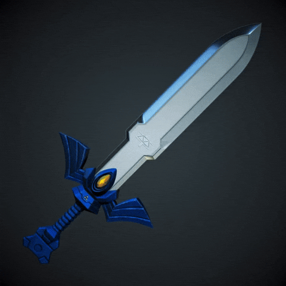
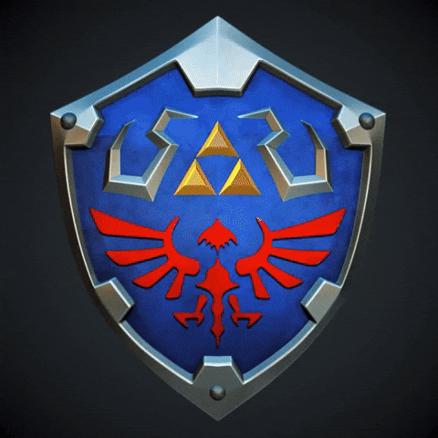

  

 

  

 

  
  
  <code>
    const MIDO = { 
    &nbsp;&nbsp;origin: "Biologist turned Coder 🧬", 
    &nbsp;&nbsp;location: "Ex-Tokyo Resident 🇯🇵", 
    &nbsp;&nbsp;passion: ["anime", "video game", "Roller coaster"], 
    &nbsp;&nbsp;status: "BUILDING PARKLYDEX 🎢" 
    };
  </code>

 

  

 

<h3 align="center">
  
</h3>

  <table>
    <tr style="border: none;">
      <td align="center" width="120">
         
        <b>Weapons</b>
      </td>
      <td align="center">
        
      </td>
    </tr>
    <tr style="border: none;">
      <td align="center" width="120">
         
        <b>Armor</b>
      </td>
      <td align="center">
        
      </td>
    </tr>
    <tr style="border: none;">
      <td align="center" width="120">
         
        <b>Tools</b>
      </td>
      <td align="center">
        
      </td>
    </tr>
  </table>

 

<h3 align="center">
  
</h3>

|  **Mission** | **Description** | **XP Gained** | **Status** |
|:---:|:---|:---:|:---:|
| **Parklydex** | 📱 App mobile pour parcs d'attractions (Data temps réel) | `React` `Node` | 🟡 Loading... |
| **Science Hubs** | 🎓 4 Plateformes web pour étudiants scientifiques | `HTML` `UI/UX` | 🟢 Complete |
| **Mael.Dev** | 🌐 Portfolio personnel animé et responsive | `Design` `Vercel` | 🟢 Complete |

 

<h3 align="center">
  
</h3>

  
  

 

  
    
  

